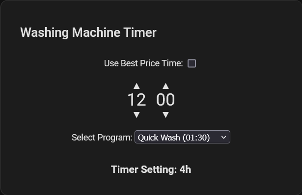

# Home Appliance Timer Card

A custom Home Assistant card that helps you time your home appliances for the cheapest electricity price times. 
The card supports both program start and program end timing, taking into account configurable program durations and optional offsets. 
It can also automatically use a sensor entity to determine the best start time based on dynamic electricity pricing.



## Basic Setup

The card can be configured directly via its YAML configuration. You can choose whether the timer should be based on the program start or the program end. 
In the program end mode, you can select from multiple programs with configurable durations and optional offsets.
When a sensor entity is provided via `price_entity`, a toggle is available to switch between manual time selection and using the best price time.

## Configuration Options

 - mode: Set to `start` to time the program start, or `end` to time the program end.
 - device_timer_interval: The interval (in minutes) that your device timer supports (default is 60 minutes for hourly settings).
 - ui_time_step: The increment for the UI minute time picker (default is 15 minutes).
 - default_time: The default desired start time in HH:MM (24h format).
 - programs: (Only used in `end` mode) A list of programs with their respective durations (in minutes) and optional offsets (in minutes). 
             The program name and duration (formatted as HH:mm) are displayed in the dropdown.
 - price_entity: (Optional) An entity that provides the time until the best electricity price (in seconds). 
                 When set, the card displays a toggle to use the best price time instead of manual time selection.

Here’s a full example YAML configuration for your Home Assistant dashboard:

```
type: custom:home-appliance-timer-card
title: "Washing Machine Timer"
mode: end  # 'start' to time program start, 'end' to time program end
device_timer_interval: 60  # Device timer can only be set hourly (60 minutes interval)
ui_time_step: 15  # UI time picker increments in 15 minute steps
default_time: "12:00"  # Desired program start time (HH:MM in 24h format)
programs:
  - name: "Quick Wash"
    duration: 90    # Duration in minutes (1:30 hours)
    offset: 0       # Optional offset in minutes
  - name: "Normal Wash"
    duration: 150   # Duration in minutes (2:30 hours)
    offset: 10      # Offset in minutes (e.g., delay before water heating starts)
price_entity: sensor.best_electricity_time  # Optional entity providing time until best price (in seconds)
```

Calculates the effective timer delay in `end` mode as: (Target start time + program duration - offset - current time) rounded up depending on `device_timer_interval`.
If the calculated delay is zero or negative, the card will display "Start now!".
Example:
  Current time: 08:10.
  Desired start time: 12:00.
  Program duration: 2:30 (150 minutes), offset: 10 minutes.
  Effective program end = 12:00 + 150 - 10 = 14:20.
  Timer Delay = 14:20 - 08:10 = 6h 10m, rounded (if only whole hours are allowed) up to 7 hours.

## Installation

#### HACS

    Navigate to the HACS tab in your Home Assistant and open the Frontend section.
    Click the three-dot menu in the top right corner.
    Select Custom repositories.
    Enter andiwirs/ha-home-appliance-timer-card as the repository and select Dashboard as the category.
    Click Add and then install the Home Appliance Timer Card from HACS.
    Refresh your browser.

See the HACS Custom Repository page for full details.

#### Manual

    Copy the home-appliance-timer-card.js file into your Home Assistant's /www folder.
    In Home Assistant, go to your Dashboard, click on Edit Dashboard, then Manage Resources.
    Add /local/home-appliance-timer-card.js as a JavaScript Module.
    Save and refresh your Home Assistant dashboard.